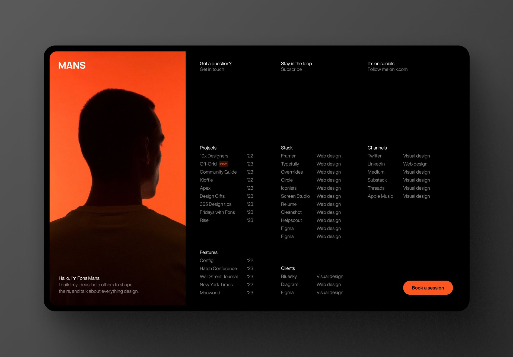

## FonsMans Portfolio Recreation in React 

**Inspired by:** [FonsMans](https://twitter.com/FonsMans) stunning visual concept shared on Twitter, I'm bringing their vision to life as a fully functional portfolio website using React!

**Design :**

**What's the project?**

This repository houses the code for my recreation of [Designer's Name]'s amazing portfolio website concept. The goal is to translate their beautiful design into a dynamic and interactive web experience powered by React.

**Tech Stack:**

* React JS
* Tailwind CSS

**Getting Started:**

1. Clone the repository.
2. Install dependencies with `npm install`.
3. Run the development server with `npm start`.
4. Open `http://localhost:3000` in your browser. 

